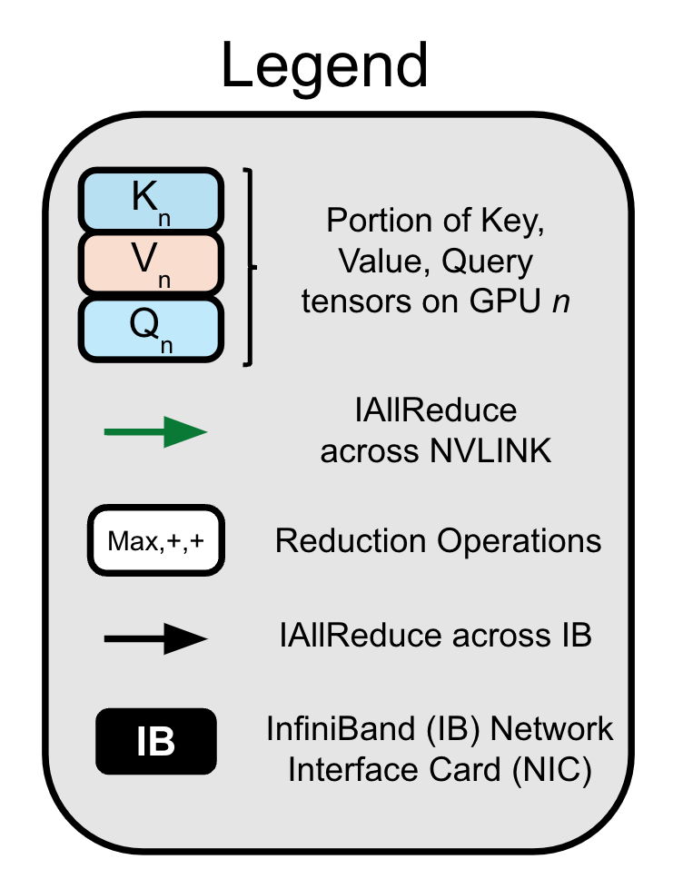

<h1 align="center">
<p>Tree Attention: Topology-aware Decoding for Long-Context Attention on GPU clusters</p>
</h1>

<p align="center">
    <a>
        
    </a>
    <a>
        
    </a>
    <a>
        
    </a>
</p>

This repository contains a simple example of tree attention in Jax, and compares to a simple Jax implementation of ring attention. For a full implementation of tree attention in PyTorch, see https://github.com/lucidrains/ring-attention-pytorch.

Self-attention is the core mathematical operation of modern transformer architectures and is also
a significant computational bottleneck due to its quadratic complexity in the sequence length. In
this work, we derive the scalar energy function whose gradient computes the self-attention block,
thus elucidating the theoretical underpinnings of self-attention, providing a Bayesian interpretation
of the operation and linking it closely with energy-based models such as Hopfield Networks. Our
formulation reveals that the reduction across the sequence axis can be efficiently computed in parallel
through a tree reduction. Our algorithm, for parallelizing attention computation across multiple
GPUs enables cross-device decoding to be performed asymptotically faster (up to 8× faster in our
experiments) than alternative approaches such as Ring Attention, while also requiring significantly
less communication volume and incurring 2× less peak memory.

**Ring Attention**    |    **Tree Attention**       |  **Legend**
:-------------------------:|:-------------------------:|:-------------------------:
     |      |    


## Requirements

- Python > 3.7
- JAX-0.4.31


### Install using Conda and pip

```bash
# Create a virtual environment
conda install cuda -c nvidia
pip install -U "jax[cuda12]"
pip install flash-attn-jax
```

### Running experiments
To run a single layer tree attention experiment, you can launch the following code. You can specify various sequence lengths, head sizes and number of heads in the file.
```bash
python tree_shard_test.py
```

